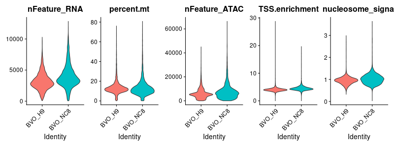
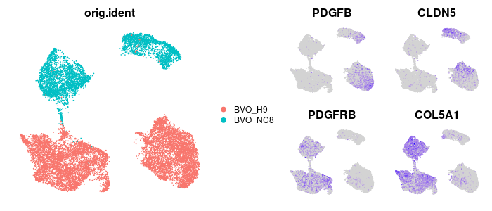
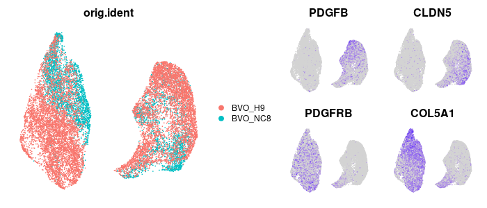
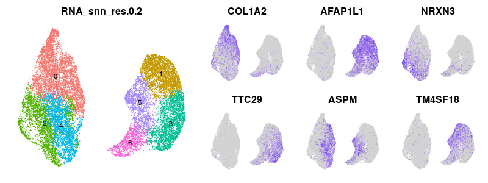
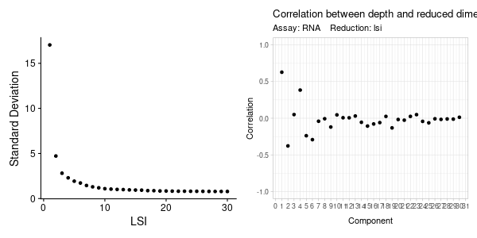
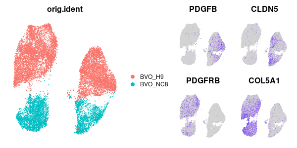
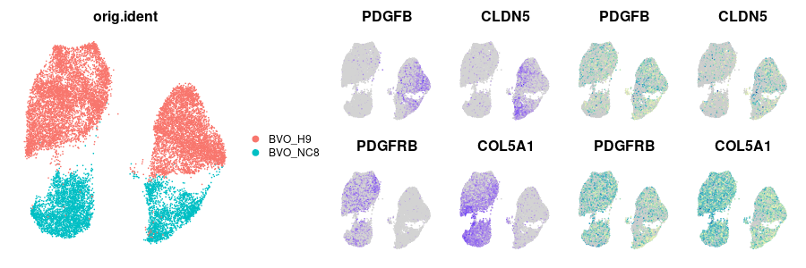
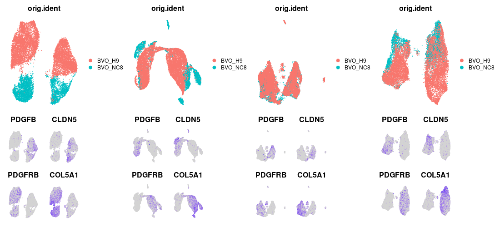
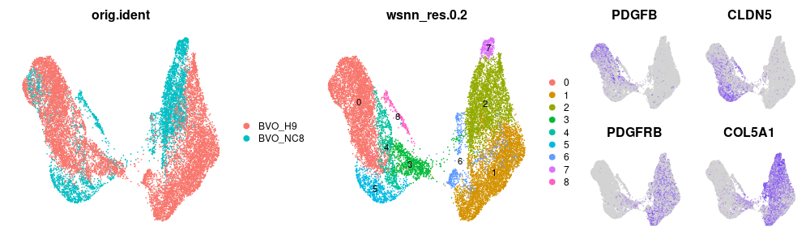
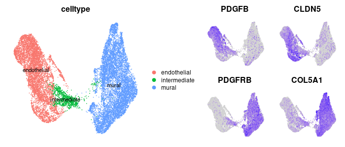

# Tutorial of single-cell RNA-ATAC multiomic sequencing data analysis in R
#### Compiled by Zhisong He, Barbara Treutlein
#### Updated on 2022-04-25
### Table of Content
 * [Introduction](#introduction)
 * [Preparation](#preparation)
 * [Section 1. Mono-modal data analysis of the scMultiome data](#section-1-mono-modal-data-analysis-of-the-scmultiome-data)
   * [Step 0. Import the required packages](#step-0-import-the-required-packages)
   * [Step 1. Load the data and create the Seurat object](#step-1-load-the-data-and-create-the-seurat-object)
   * [Step 2. Quality control](#step-2-quality-control)
   * [Step 3. Analysis on the RNA assay](#step-3-analysis-on-the-rna-assay)
   * [Step 4. Analysis on the ATAC assay](#step-4-analysis-on-the-atac-assay)
     * [Step 4.1. Feature selection](#step-41-feature-selection)
     * [Step 4.2. Normalization](#step-42-normalization)
     * [Step 4.3. Linear dimension reduction](#step-43-linear-dimension-reduction)
     * [Step 4.4. Non-linear dimension reduction with UMAP for visualization](#step-44-non-linear-dimension-reduction-with-umap-for-visualization)
     * [Step 4.O. What if we don't have the RNA information](#step-4o-what-if-we-dont-have-the-rna-information)
     * [Step 4.5. Data integration of the ATAC assay](#step-45-data-integration-of-the-atac-assay)
 * [Section 2. Bi-modal integrative analysis of the RNA-ATAC scMultiome data](#section-2-bi-modal-integrative-analysis-of-the-rna-atac-scmultiome-data)
   * [Step 1. Weighted nearest neighbor analysis](#step-1-weighted-nearest-neighbor-analysis)
   * [Step 2. Cell type gene/peak marker identification and visualization of the chromatin accessibility profiles](#step-2-cell-type-genepeak-marker-identification-and-visualization-of-the-chromatin-accessibility-profiles)
 * [Section 3. Gene regulatory network reconstruction](#section-3-gene-regulatory-network-reconstruction)


## Introduction
Besides single-cell RNA-sequencing (scRNA-seq), there are nowadays more single-cell genomic technologies being developed to characterize different molecular signatures of single cells. Among them, single-cell assay for transposase-accessible chromatin using sequencing (scATAC-seq) is probably the most commonly used one. The ATAC-seq technology probes open chromatin with hyperactive mutant Tn5 Transposase that inserts sequencing adapters into open regions of the genome, to identify genomic regions of the measured sample which allows the binding of trans-regulatory factors, e.g. transcriptional factors. Those regions are likely the important regulatory genomic regions such as promoters or enhancers. On top of that, the scATAC-seq technology provides such chromatin accessibility information of single cells, which provides the epigenomic information of different cell types/states in a tissue that cannot be captured by scRNA-seq which only measures the transcriptome.

One difficulty when analyzing scATAC-seq data, though, is to annotate different cell populations identified in the data, as in most of the time, the definition of a cell type or state is based on the expression or certain gene markers, which is not directly measured by scATAC-seq experiments. There are computational methods developed that try to predict the transcriptomic outcomes given the chromatin accessibility information, and then annotate cells based on such prediction. One simple but good example is the gene activity score used in ```Signac```, the sister package of ```Seurat``` but specifically for scATAC-seq data analysis. This method sums the ATAC fragments intersecting the gene body and promoter region as the putative "gene activity", and uses it as the inferred gene expression for annotating cells as well as the potential integration with scRNA-seq data. This method generally works but definitely imperfect. Also, lacking the information of both transcriptome and epigenome for the same cell makes it hard to answer some interesting questions, such as whether there is any "lagging" of expression change relative to the epigenomic changes which may provide causal information between the two modalities.

Such an issue is then largely solved, by the technologies which can measure both the transcriptome and open chromatin profiles of the same cells. In 2020, 10x Genomics released their comercial single-cell RNA-ATAC multiome platform, allowing simultaneous measure of gene expression and chromatin accessibility profile in the same cells. There are also other techniques with different mechanisms. One good example is [sci-CAR](https://www.science.org/doi/10.1126/science.aau0730) developed by Jay Shendure's lab in University of Washington, which uses a pooled barcode method to jointly capture and then dissect the transcriptomic and chromatin accessibility profiles of the same cells.

No matter with which method, once we get not only one modality of the data but two for each cell, there are much more that we can do, by not only having double the amount of analysis to do because of doubling of the data, but also jointly analyzing the two modalities together for some more interesting insight. In this tutorial, we will briefly talk about how we can analyze the single-cell RNA-ATAC multiomic sequencing data (scMultiome) in R using ```Seurat``` and ```Signac```, the sister package of Seurat but mostly for scATAC-seq data analysis. We will talk about the basic analysis pipeline of the two modalities separately, the basic joint analysis for clustering and visualization, the more advanced joint analysis to look for potential important transcription regulators, and also to reconstruct gene regulatory network using both modalities.

If you are a beginner of single-cell transcriptomic data analysis, we recommend [another tutorial we prepared for scRNA-seq data analysis](https://github.com/quadbiolab/scRNAseq_analysis_vignette). Besides, we have another tutorial also for [scRNA-seq data analysis but focusing on comparison between different conditions](https://github.com/quadbiolab/scRNAseq_comparison_vignette).

## Preparation
In this tutorial, we assume the data being generated with the 10x multiome platform, and have been preprocessed (base calling, sample demultiplexing, mapping, peak calling, read counting) using the 10x Genomic analysis pipeline [Cell Ranger ARC](https://support.10xgenomics.com/single-cell-multiome-atac-gex/software/pipelines/latest/what-is-cell-ranger-arc). As a part of the tutorial, we provide one example data set, which is a scMultiome data of the blood vessle organoids cultured for seven days. This data is a part of the data presented in the paper "[Fate and state transitions during human blood vessel organoid development](https://www.biorxiv.org/content/10.1101/2022.03.23.485329v1)".

This tutorial contains three sections. In the first section, we will quickly go through the analysis on transcriptome, and then mention the analysis we can do based on the chromatin accessibility profiles. In the second section, we will start to do the bimodal integrative analysis to look for potential regulators in the system. In the third section, we will introduce [Pando](https://quadbiolab.github.io/Pando/), the algorithm to reconstruct gene regulatory network (GRN) using both of the data modalities, and apply it to the data to reconstruct the GRN responsible for cell type signature maintenance of the system.

## Section 1. Mono-modal data analysis of the scMultiome data
### Step 0. Import the required packages
As mentioned, we use ```Seurat``` and ```Signac``` packages to do most of the analysis in R. As the first step of the analysis, we import the two packages, so as the ```dplyr``` package which provides the pipe operator function as well as some other convenience functions to manipulate data frames.
```R
library(Seurat)
library(Signac)
library(Matrix)
library(dplyr)
```

### Step 1. Load the data and create the Seurat object
One major difference between the scRNA-seq and scMultiome (and scATAC-seq as well) data is that for transcriptome, when the same annotation is used, the genes representated in the count matrix are the same regardless of data sets. For the ATAC-seq assay, however, there is no such a comprehensive annotation of possible open chromatin or regulatory regions like genes. Therefore, before doing read counting, there is the peak calling step to look for genomic regions with significantly more accumulative reads covered than the surrounding background regions. As mentioned above, this step is a part of the Cell Ranger ARC pipeline, and it usually returns tens of thousands of peaks for one sample. After that, it counts the number of reads or fragments overlapping with each of those regions to generate an ATAC fragment count matrix. After running Cell Ranger ARC, one would therefore obtain two different count matrices with the same number of columns (cells) but different numbers of rows (genes or peaks), one for transcriptome and one for chromatin accessibility profiles. Both matrices are stored as separated .mtx files, but also together in one .h5 file. Here we directly read the .h5 file using the ```Read10X_h5``` function in the ```Seurat``` package, which returns a list of two sparse matrices, one for each assay. Note that in the example data there are two samples, and one .h5 file for each of them.

```R
counts_NC8 <- Read10X_h5("data/NC8/filtered_feature_bc_matrix.h5")
counts_H9 <- Read10X_h5("data/H9/filtered_feature_bc_matrix.h5")
```

For the RNA assay, the count matrix is already sufficient. For the ATAC assay, on the other hand, while it is also possible to just use the count matrix, it is required to add extra information in order to allow more ATAC-based analysis. Those information includes the gene annotations (so that the relative location of a peak to the annotated genes are known) and the ATAC fragment table. The former one can be easily retrieved from Ensembl using the R package ```AnnotationHub```. The latter one is a part of the Cell Ranger ARC output (atac_fragments.tsv.gz), which is the intermediate data summarizing the mapping result of the ATAC data by collapsing identical reads with the same cellular barcode, merging overlapping reads from the same cell into fragments, and discarding any information which is not needed to identify and quantify open chromatin regions (e.g. the sequence of the reads).

Firstly let's retrieve the gene annotation.
```R
ah <- AnnotationHub()
ensdbs <- query(ah, c("EnsDb.Hsapiens"))

ensdb_id <- ensdbs$ah_id[grep(paste0(" 98 EnsDb"), ensdbs$title)]
ensdb <- ensdbs[[ensdb_id]]

seqlevelsStyle(ensdb) <- "UCSC"
annotations <- GetGRangesFromEnsDb(ensdb = ensdb)
genome(annotations) <- "hg38"
```
Here we use the human gene annotation in Ensembl v98 database. This is also the version of annotation used for the RNA assay. The chromosome name is set to have the UCSC style so that they are called "chr1", "chr2" etc. rather than "1", "2" etc. so that they match with the name used in the reference genome used by the default Cell Ranger ARC pipeline.

Next, we create the Seurat object for each sample, using the expression count matrix to generate the RNA assay, and the ATAC fragment count matrix as well as the above retrieved annotation and the link to the fragment table file to generate the ATAC assay.
```R
seurat_NC8 <- CreateSeuratObject(counts = counts_NC8$`Gene Expression`,
                                 assay = "RNA",
                                 project = "BVO_NC8")
seurat_NC8[['ATAC']] <- CreateChromatinAssay(counts = counts_NC8$`Peaks`,
                                             annotation = annotations,
                                             fragments = "data/NC8/atac_fragments.tsv.gz",
                                             sep = c(":", "-"),
                                             genome = 'hg38')

seurat_H9 <- CreateSeuratObject(counts = counts_H9$`Gene Expression`,
                                assay = "RNA",
                                project = "BVO_H9")
seurat_H9[['ATAC']] <- CreateChromatinAssay(counts = counts_H9$`Peaks`,
                                            annotation = annotations,
                                            fragments = "data/H9/atac_fragments.tsv.gz",
                                            sep = c(":", "-"),
                                            genome = 'hg38')
```

Afterwards, we need to combine the two biological replicate samples for the following analysis. Technically to combine two Seurat object we just can use the ```merge``` function in the ```Seurat``` package.
```R
seurat <- merge(seurat_NC8, seurat_H9)
```

This would just work all fine for the RNA assay. For the ATAC assay, however, this is not enough. As mentioned above, peak calling is required in the preprocessing to identify regions with detected accessibility in the sample. This step, however, is applied to different samples separately, and therefore generates different peak list for different samples. This simply makes the merging failed.

To properly combine the ATAC assay, the critical steps are to firstly obtain a unified peak list for all samples, and then redo fragment counting based on the new peak list. To do that, there are several options.

1. Cell Ranger ARC has the command ```aggr``` which is designed to aggregate multiple 10x multiome experiments. One part of its pipeline is to redo peak calling by aggregating the fragment tables of all samples. Afterwards, we can direct read in the .h5 file in the aggregated sample output folder, as well as the aggregated fragment file.

2. We can union the peak lists of different samples called by Cell Ranger ARC to get the unified peak list, and then do the fragment counting again for all cells in all samples. Here the union means also to merge peaks from different samples which are partially overlapping with each other. ```Signac``` uses an ```GRanges``` object, which is a commonly used class defined in the ```GenomicRanges``` package as a critical part of Bioconductor for genomic analysis. The package also has methods to manipulate the GRanges objects in the way we need. Here, we can use the ```reduce``` function which collapses all the overlapping regions into one so that there is no overlap between any pair of region in the final list.

```R
peaks <- reduce(unlist(as(c(seurat_NC8@assays$ATAC@ranges,
                            seurat_H9@assays$ATAC@ranges),
                          "GRangesList")))
peakwidths <- width(peaks)
peaks <- peaks[peakwidths < 10000 & peakwidths > 20]

counts_atac_merged <- FeatureMatrix(seurat@assays$ATAC@fragments,
                                    features = peaks,
                                    cells = colnames(seurat))
seurat[['ATAC']] <- CreateChromatinAssay(counts_atac_merged,
                                         fragments = seurat@assays$ATAC@fragments,
                                         annotation = seurat@assays$ATAC@annotation,
                                         sep = c(":","-"),
                                         genome = "hg38")
```

3. We can redo the peak calling step. In ```Signac``` there is a wrapper function called ```CallPeaks```. It calls [MACS (Model-based Analysis of ChIP-Seq)](https://hbctraining.github.io/Intro-to-ChIPseq/lessons/05_peak_calling_macs.html), the commonly used peak calling algorithm that originally designed for ChIP-seq data, to de novo call peaks. By default, it pools all the fragments of all cells to do it; but it also has the option to call peaks given a grouping column in the metadata, so that it calls peaks for each group separately first and then combine the called peaks of different groups to get the unified peak list.

```R
peaks <- CallPeaks(seurat,
                   assay="ATAC",
                   group.by="orig.ident",
                   macs2.path="/usr/bin/macs2")
counts_atac <- FeatureMatrix(seurat@assays$ATAC@fragments,
                             features = peaks,
                             cells = colnames(seurat))
seurat[['ATAC']] <- CreateChromatinAssay(counts_atac,
                                         fragments = seurat@assays$ATAC@fragments,
                                         annotation = seurat@assays$ATAC@annotation,
                                         genome = 'hg38')
```

Once we get the new unified peak list and its count matrix, we can further subset the peaks to just focus on those at the standard chromosomes. This step is not a must but recommended as it makes some following analysis that requires calculation of local background GC content much easier.

```R
library(BSgenome.Hsapiens.UCSC.hg38)
standard_chroms <- standardChromosomes(BSgenome.Hsapiens.UCSC.hg38)
idx_standard_chroms <- which(as.character(seqnames(granges(seurat[['ATAC']]))) %in% standard_chroms)
seurat[["ATAC"]] <- subset(seurat[["ATAC"]],
                           features = rownames(seurat[["ATAC"]])[idx_standard_chroms])
seqlevels(seurat[['ATAC']]@ranges) <- intersect(seqlevels(granges(seurat[['ATAC']])),
                                                unique(seqnames(granges(seurat[['ATAC']]))))
```

### Step 2. Quality control
Now we have the Seurat object with the data stored. The next step is to do quality control, excluding cells which are not measured properly or for any reason with bad quality. There are several commonly used metrics for this.

For the RNA assay, what we would check are similar to the typical scRNA-seq. We try to filter out cells with too few or too many detected genes or transcripts (UMIs), as well as those with too high mitochondrial transcript percentage, just as mentioned in the [scRNA-seq data analysis tutorial](https://github.com/quadbiolab/scRNAseq_analysis_vignette).

For the ATAC assay, we would also look at the number of detected peaks or detected fragments, similar to the RNA assay. On top of that, we would also exclude cells with too weak fragment enrichment around the transcriptional start sites (TSS). We can also quantify the approximate ratio of ATAC fragments with a strong nucleosome banding pattern (those with fragment lengths around a single nucleosome) that unlikely represent real accessible genomic regions, in relative to the nucleosome-free fragments, and then discard cells with too high of such ratio.

```R
seurat <- PercentageFeatureSet(seurat, pattern = "^MT-", col.name = "percent.mt", assay = "RNA")
seurat <- NucleosomeSignal(seurat, assay = "ATAC")
seurat <- TSSEnrichment(seurat, assay = "ATAC")

VlnPlot(seurat,
        features = c("nFeature_RNA",
                     "percent.mt",
                     "nFeature_ATAC",
                     "TSS.enrichment",
                     "nucleosome_signal"),
        ncol = 5,
        pt.size = 0)
```

<br/><br/>

Based on the distributions, we can manually set the cutoffs for each metric to exclude the outlier cells.
```R
seurat <- subset(seurat,
  subset = nFeature_RNA > 1000 &
    nFeature_RNA < 7500 &
    percent.mt < 30 &
    nFeature_ATAC > 1000 &
    nFeature_ATAC < 30000 &
    TSS.enrichment > 1 &
    nucleosome_signal < 2
)
```

### Step 3. Analysis on the RNA assay
Now we can start to do analysis for the RNA and ATAC assay separately, and we start with the RNA assay. Here we don't go into the details of all the steps. For those who would like to know more details, please refer to the [scRNA-seq data analysis tutorial](https://github.com/quadbiolab/scRNAseq_analysis_vignette) we prepared in parallel. In brief, what we will do include data normalization, highly variable genes identification, data scaling, principal component analysis (PCA), and then generate the UMAP embedding. Then, we can do feature plots for several markers of cell types we expect to see in the blood vessel organoids, including endothelial cells (PDGFB+, CLDN5+) and mural cells (PDGFRB+, COL5A1+).

```R
DefaultAssay(seurat) <- "RNA"

seurat <- NormalizeData(seurat) %>%
  FindVariableFeatures(nfeatures = 3000) %>%
  CellCycleScoring(s.features = cc.genes.updated.2019$s.genes,
                   g2m.features = cc.genes.updated.2019$g2m.genes) %>%
  ScaleData() %>%
  RunPCA(npcs = 50) %>%
  RunUMAP(dims = 1:20, reduction.name = "umap_rna", reduction.key = "UMAPRNA_")

p1 <- DimPlot(seurat, group.by = "orig.ident", reduction = "umap_rna") & NoAxes()
p2 <- FeaturePlot(seurat,
                  c("PDGFB","CLDN5","PDGFRB","COL5A1"),
                  reduction = "umap_rna") & NoAxes() & NoLegend()
p1 | p2
```
<br/><br/>
<span style="font-size:0.8em">*P.S. In the example script here, we use the typical procedure of log-normalization plus vst variable gene identification method plus z-transformation for data scaling. It is worth mentioning that there is the alternative way of using ```SCTransform```. Indeed, there is the opinion that SCTransform may work better as the 10x multiome technology captures the RNA in the nucleus only (so it is actually single-nucleus RNA-seq), and therefore have generally lower detected transcript number than typical scRNA-seq experiment; while principally speaking SCTransform should work better than the classical normalization in such a scenario. In reality, they might not provide very different results, but this is something to keep in mind which also worths a try when you find the result of one way looking weird.*</span>


There seems to be pretty strong batch effect between the two biological replicates, and we shall therefore try to do data integration. There are quite many integration methods developed for scRNA-seq data, some of which have been introduced in [the other tutorial](https://github.com/quadbiolab/scRNAseq_analysis_vignette). Usually the suggestion would be to try several and then choose one based on how well different samples are mixed and whether the feature plots make sense when checking the marker expression of some expected cell types; but here we will directly use [CSS](https://github.com/quadbiolab/simspec) which was also used in the original paper introducing this data set.

```R
library(simspec)
seurat <- cluster_sim_spectrum(seurat,
                               label_tag = "orig.ident",
                               cluster_resolution = 0.6,
                               reduction.name = "css_rna",
                               reduction.key = "CSSRNA_")
seurat <- RunUMAP(seurat,
                  reduction = "css_rna",
                  dims = 1:ncol(Embeddings(seurat,"css_rna")),
                  reduction.name = "umap_css_rna",
                  reduction.key = "UMAPCSSRNA_")

p1 <- DimPlot(seurat, group.by = "orig.ident", reduction = "umap_css_rna") & NoAxes()
p2 <- FeaturePlot(seurat,
                  c("PDGFB","CLDN5","PDGFRB","COL5A1"),
                  reduction = "umap_css_rna") & NoAxes() & NoLegend()
p1 | p2
```
<br/><br/>

The integration works pretty well based on the marker expression. Afterwards we can do clustering and cluster marker identification, just as in the typical scRNA-seq data analysis.
```R
seurat <- FindNeighbors(seurat,
                        reduction = "css_rna",
                        dims = 1:ncol(Embeddings(seurat,"css_rna"))) %>%
  FindClusters(resolution = 0.2)

DE_cl_rna <- presto::wilcoxauc(seurat, "RNA_snn_res.0.2")
top_markers <- DE_cl_rna %>%
  filter(logFC > log(1.2) &
         auc > 0.7 &
         padj < 0.01 &
         pct_in - pct_out > 30 &
         pct_out < 30) %>%
  group_by(group) %>%
  top_n(1, wt = auc)

p1 <- DimPlot(seurat,
              group.by="RNA_snn_res.0.2",
              reduction="umap_css_rna", label=T) & NoAxes() & NoLegend()
p2 <- FeaturePlot(seurat,
                  features = unique(top_markers$feature),
                  reduction="umap_css_rna",
                  order = T,
                  ncol=3) & NoAxes() & NoLegend()
(p1 | p2) + patchwork::plot_layout(widths = c(2,3))
```
<br/><br/>

### Step 4. Analysis on the ATAC assay
The general procedure of analyzing an ATAC assay is actually quite similar to the RNA counterpart. The steps include feature selection, data normalization, linear dimension reduction, non-linear dimension reduction for visualization, clustering and annotation, and marker identification. On the other hand, there are detailed differences between the analysis of the two modalities, mostly because the methods being used can be quite different.

#### Step 4.1. Feature selection
The first difference between analysis of RNA and ATAC assays is how to select features for further heterogeneity analysis. For the RNA assay, commonly used methods involve ```vst``` and ```SCTransform```, and they select genes mostly based on the expression variantion of each gene across all the cells. This mechanism relies on the fact that the expression levels of a gene in different cells can be largely seen as cotinuous values. For the ATAC assay, however, technically this may be still true but conceptually this is no longer valid as one cell (at least for a normal human cell) contains only two copies of DNA, and a certain genomic region in one cell is either accessible or inaccessible in each of the two copies. This makes the accessibility levels rather discrete than continuous. Therefore, instead of using the variantion-based feature selection methods, the even simplier method is usually used for ATAC assay, which is to select peaks being detected in sufficient number of cells in the data. Here the number can be a fixed numeric number, or the percentile of peaks in terms of how commonly detected it is across cells. The selected features are therefore called "top features" instead of "variable features". Here let's select all the peaks with fragment detected in at least 50 cells.
```R
DefaultAssay(seurat) <- "ATAC"
seurat <- FindTopFeatures(seurat, min.cutoff = 50)
```

#### Step 4.2. Normalization
Next, we need to do the data normalization, and it also comes the second difference between analyzing RNA and ATAC data. For RNA assay, the normalization step relies on certain assumptions, for instance, that every cell should contain the same amount of RNA (the size normalization used in log-normalization method). Those assumptions, however, doesn't match with the nature of ATAC data. Therefore, a different method called [TF-IDF](https://en.wikipedia.org/wiki/Tf%E2%80%93idf), short for **T**erm **F**requency–**I**nverse **D**ocument **F**requency, is used for ATAC data normalization instead. This is a statistic often used in searches of information retrieval, text mining, and user modeling. The calculation of TF-IDF includes the calculation of TF and IDF, and is implemented in the function ```RunTFIDF``` in the ```Signac``` package. The TF value is proportional to the frequency of a term (i.e. the number of fragments in a peak) in a document (i.e. a cell), and normalized by the total frequency of the term in all documents. The IDF value is the inverse of the proportion of documents that contains this term (i.e. the proportion of cells with any fragment within the peak detected). By default, the TF-IDF is then defined as TF times IDF followed by log-transformation (```method = 1```). There are also other options, for instance, TF times log-transformed IDF (```method = 2```), and log-transformed TF times log-transformed IDF (```method = 3```).
```R
seurat <- RunTFIDF(seurat, method = 1)
```

Another reason of using TF-IDF for ATAC-seq data is that its scales of different peaks, regardless the size of the peaks, should be comparable, and therefore the further data scaling becomes unnecessary. Computationally this is very important. From the definition it is clear that for peaks with no fragment detected in a cell, its TF-IDF value remains zero. Therefore, the TF-IDF matrix can be still represented by a sparse matrix, and then is directly used as the input for the next analysis without the need to generating a scaled data matrix which is likely a high-dimensional dense matrix that needs huge amount of memory to store.

#### Step 4.3. Linear dimension reduction
Similar to doing PCA for linear dimension reduction for the RNA assay, a linear dimension reduction is also needed for the ATAC assay to denoise the data as well as to reduce the computational complexity. In the Signac pipeline, instead of doing PCA with ```RunPCA```, singular value decomposition (SVD), implemented as ```RunSVD```, is used to do dimension reduction for ATAC data. As you may have known, PCA and SVD are very much related. In fact, the calculation of PCA is usually done via SVD (see [here](https://stats.stackexchange.com/questions/134282/relationship-between-svd-and-pca-how-to-use-svd-to-perform-pca) for more explanations). If you check the source code of ```RunPCA``` and ```RunSVD``` functions, you would probably realize easily that the key part of them two are exactly the same. What actually make the two behave a bit differently is that by default, ```RunSVD``` scales each component of the dimension reduction embeddings to mean 0 and SD 1, while no such scaling is applied in ```RunPCA```.
```R
seurat <- RunSVD(seurat, n = 50)
```

#### Step 4.4. Non-linear dimension reduction with UMAP for visualization
Once we get the SVD result, we can then generate the UMAP embedding given the SVD dimension reduction result as the input. This is very similar to the same step for scRNA-seq, just need to keep in mind to set ```reduction = "lsi"``` to tell the ```RunUMAP``` function (or ```RunTSNE``` function if you prefer t-SNE for visualization) to use the SVD result.

And similar to scRNA-seq, we also need to decide which components of the SVD results to use. By default ```RunSVD``` calculates the first 50 components (```n = 50```), but usually we don't use them all. Similar to the way we select the top components of PCA for the scRNA-seq data, we also try to select the first SVD components for the following analysis. Here the elbow plot (```ElbowPlot```), which shows the explained variance per component, may help. However, what makes it a bit different is that the first SVD component, which explains the most variance of the data, is usually highly correlated with total counts of the ATAC fragments per cell, and therefore represents more technical variance than biological variance. In this case, we would exclude the first SVD component and start from the second one. And since the first SVD component usually explains a lot more variance than the rest, it unfortunately makes the elbow plot less informative than when it is used to check the principal components for scRNA-seq data.

To confirm the correlation with the coverage, we can plot the correlation between each component and total count number per cell using the function ```DepthCor```.
```R
p1 <- ElbowPlot(seurat, ndims = 30, reduction="lsi")
p2 <- DepthCor(seurat, n = 30)
p1 | p2
```
<br/><br/>

Next we use the 2nd to the 30th SVD components to generate the UMAP embedding of the ATAC assay. And since this is a scMultiome data set with gene expression information, we can also do feature plot of the marker genes mentioned above but using the ATAC-based UMAP.
```R
seurat <- RunUMAP(seurat,
                  reduction = "lsi",
                  dims = 2:30,
                  reduction.name = "umap_atac",
                  reduction.key = "UMAPATAC_")
p1 <- DimPlot(seurat,
              group.by = "orig.ident",
              reduction = "umap_atac") & NoAxes()
p2 <- FeaturePlot(seurat,
                  c("PDGFB","CLDN5","PDGFRB","COL5A1"),
                  reduction = "umap_atac") & NoAxes() & NoLegend()
p1 | p2
```
<br/><br/>

So similar to the RNA assay, the two biological replicates are separated completely, although both contains mural cells and endothelial cells in general. This implies potential batch effect just as the RNA assay.

#### Step 4.O. What if we don't have the RNA information
The RNA information in the multiome data is great because it is much easier to annotate cell types/states by gene expression. However, what if we have scATAC-seq rather than scMultiome data? In that case is there a way to "predict" the gene expression based on the ATAC fragments? Although not perfect, there is indeed some possible solutions.

The way that's the easiest is to use the ```GeneActivity``` function in ```Signac```. What it does essentially is to count the number of fragments per cell that are overlapping with the annotated gene body of each gene. This fragment counts per gene per cell can be then normalized using the log-normalization method and then used as the proxy of gene expression in this cell. We can also apply this strategy in our scMultiome data and compare this predicted gene activity with the measured gene expression levels.
```R
gene_act <- GeneActivity(seurat)
seurat[['RNA_inferred']] <- CreateAssayObject(gene_act) %>% NormalizeData()

DefaultAssay(seurat) <- "RNA_inferred"
beach_colscheme <- colorRampPalette(c("#cdcdcd","#edf8b1","#7fcdbb","#41b6c4","#1d91c0","#225ea8","#0c2c84"))
p3 <- FeaturePlot(seurat,
                  c("PDGFB","CLDN5","PDGFRB","COL5A1"),
                  reduction = "umap_atac",
                  cols = beach_colscheme(30)) & NoAxes() & NoLegend()
p1 | p2 | p3
```
<br/><br/>

Although the signal is much less clear than the real RNA assay, we can still see the cell populations on the left have higher predicted activity of PDGFRB and COL5A1, while the right ones have higher predicted CLDN5 activity. This is consistent with the real gene expression information.

#### Step 4.5. Data integration of the ATAC assay
As we see the potential batch effect also in the ATAC assay, we shall then consider doing data integration or batch effect correction for the ATAC assay just like what we do for the RNA assay. While most of the data integration methods were developed for scRNA-seq data, many of them are also applicable to the ATAC assay. Those methods include but not limit to [Seurat](https://satijalab.org/signac/articles/integrate_atac.html), [Harmony](https://portals.broadinstitute.org/harmony/) and [CSS](https://github.com/quadbiolab/simspec). The way of using those integration methods is also quite similar to when applying them to the RNA assay.

For CSS and Harmony, just to make sure that it should be the SVD embedding (by default called "lsi") instead of the PCA embedding (by default called "pca") being used as the input.

```R
DefaultAssay(seurat) <- "ATAC"

library(simspec)
seurat <- cluster_sim_spectrum(seurat,
                               label_tag = "orig.ident",
                               use_dr = "lsi",
                               dims_use = 2:30,
                               cluster_resolution = 0.6,
                               reduction.name = "css_atac",
                               reduction.key = "CSSATAC_")
seurat <- RunUMAP(seurat,
                  reduction = "css_atac",
                  dims = 1:ncol(Embeddings(seurat,"css_atac")),
                  reduction.name = "umap_css_atac",
                  reduction.key = "UMAPCSSATAC_")

library(harmony)
seurat <- RunHarmony(seurat,
                     group.by.vars = "orig.ident",
                     reduction = "lsi",
                     dims.use = 2:30,
                     max.iter.harmony = 50,
                     reduction.save = "harmony_atac")
seurat <- RunUMAP(seurat,
                  reduction = "harmony_atac",
                  dims = 1:ncol(Embeddings(seurat,"harmony_atac")),
                  reduction.name = "umap_harmony_atac",
                  reduction.key = "UMAPHARMONYATAC_")
```

For Seurat it is a bit different. The first step is still to identify the anchors, although using the reduction method "rlsi" instead of the default value "cca" for the RNA assay. The second step is different. Instead of using the ```IntegrateData``` function in the RNA assay to impute the integrated gene expression, here it will be the SVD embedding being integrated to generate a new integrated embeddings. This step relies on the function ```IntegrateEmbeddings```.

```R
integration.anchors <- FindIntegrationAnchors(
  object.list = SplitObject(seurat, "orig.ident"),
  anchor.features = rownames(seurat),
  reduction = "rlsi",
  dims = 2:30
)
seurat_integrated <- IntegrateEmbeddings(
  anchorset = integration.anchors,
  reductions = seurat[["lsi"]],
  new.reduction.name = "integrated_lsi",
  dims.to.integrate = 1:30
)
seurat[['integrated_lsi_atac']] <- CreateDimReducObject(
  Embeddings(seurat_integrated, "integrated_lsi")[colnames(seurat),], key="INTEGRATEDLSIATAC_", assay="ATAC"
)
seurat <- RunUMAP(seurat,
                  reduction = "integrated_lsi_atac",
                  dims = 2:30,
                  reduction.name = "umap_seurat_atac",
                  reduction.key = "UMAPSEURATATAC_")
```

Now we can visualize and compare the results

```R
DefaultAssay(seurat) <- "RNA"
Reduce("|", lapply(c("umap_atac",
                     "umap_css_atac",
                     "umap_harmony_atac",
                     "umap_seurat_atac"), function(dr){
  p1 <- DimPlot(seurat,
                group.by = "orig.ident",
                reduction = dr) & NoAxes()
  p2 <- FeaturePlot(seurat,
                    c("PDGFB","CLDN5","PDGFRB","COL5A1"),
                    reduction = dr) & NoAxes() & NoLegend()
  p1 / p2
}))
```
<br/><br/>

Generally speaking, all the three integration methods work to reduce the difference between the two replicates. In the following analysis, the CSS-integrated one would be used to be in line with the original publication.

With or without the data being integrated, we can also do clustering based on the ATAC data using the same procedure as for the RNA assay. Similarly, we can also do marker identification using the ```FindMarkers``` function in ```Seurat``` (recommended to use ```test.use = 'LR'```, which also allows additional confounding covariates being considered by setting the ```latent.vars``` parameter), or the ```wilcoxauc``` function in ```presto``` for the fast Wilcoxon test. Here we don't show the details.

## Section 2. Bi-modal integrative analysis of the RNA-ATAC scMultiome data
Since we have both the RNA and ATAC information in the scMultiome experiment, and they may have different capacity discriminating different cell populations, it would be good to try if we can integrate the information from both sides for the heterogeneity analysis. What's more, combining the RNA and ATAC information may also allow us to look deeper into the transcriptional regulation, for example, to identify potential transcription factors which are important to define cell type identities. In this section, we will briefly show how these analysis can be done with ```Seurat``` and ```Signac``` in R.

### Step 1. Weighted nearest neighbor analysis
In ```Seurat```, generating the UMAP embedding and doing clustering by taking both RNA and ATAC modalities into consideration is achievable via the weighted nearest neighbor graph method. The idea is to generate a k-nearest neighbor (kNN) network of cells, but this network is generated based on the information of both modalities. On the other hand, instead of simply averaging the two distances or unioning the kNN of each modality, it firstly calculates weights about how much each modality should contribute in defining neighbors for each cell. In brief, it does within-modal and cross-modal prediction by averaging the data of one modality (not the raw data, but the dimension reduced embedding) of its kNNs of the same (within-modal) or the other (cross-modal) modality. One modality gets a higher score in a cell if its within-modal prediction is better than the cross-modal prediction, and the scores of the two modalities are then normalized to be with sum of one. The method details can be seen in one of the Seurat methodology paper ([Hao et al. 2021, Cell](https://www.sciencedirect.com/science/article/pii/S0092867421005833)).

Therefore, the first step to do is to reconstruct the weighted nearest neighbor graph.
```R
seurat <- FindMultiModalNeighbors(seurat,
                                  reduction.list = list("css_rna", "css_atac"),
                                  dims.list = list(1:ncol(Embeddings(seurat,"css_rna")),
                                                   1:ncol(Embeddings(seurat,"css_atac"))),
                                  modality.weight.name = c("RNA.weight","ATAC.weight"),
                                  verbose = TRUE)
```

The ```FindMultiModalNeighbors``` function generates a neighbor network called "weighted.nn" by default and stores it at the ```neighbors``` slot of the Seurat object. It also generates two neighbor graphs called "wknn" and "wsnn" by default which are both stored at the ```graphs``` slot, just like the graphs generated by the ```FindNeighbors``` function when doing mono-modal analysis. The "weighted.nn" object can be then used as the input to generate the UMAP embedding, while the "wsnn" graph can be used for clustering.

```R
seurat <- RunUMAP(seurat, nn.name = "weighted.nn", assay = "RNA")
seurat <- FindClusters(seurat, graph.name = "wsnn", resolution = 0.2)

p1 <- UMAPPlot(seurat, group.by = "orig.ident") & NoAxes()
p2 <- UMAPPlot(seurat, group.by = "wsnn_res.0.2", label=T) & NoAxes()
p3 <- FeaturePlot(seurat,
                  c("PDGFB","CLDN5","PDGFRB","COL5A1"),
                  reduction = "umap") & NoAxes() & NoLegend()
p1 | p2 | p3
```
<br/><br/>

Next, we do a rough annotation of mural cells and endothelial cells in the data. The following analysis will focus on that level.
```R
seurat$celltype <- setNames(rep(c("endothelial","mural","intermediate"), c(4,4,1)),
                            c(c(0,4,5,8),c(1,2,6,7),3))[as.character(seurat$wsnn_res.0.2)]

p1 <- UMAPPlot(seurat, group.by = "celltype", label=T) & NoAxes()
p2 <- FeaturePlot(seurat,
                  c("PDGFB","CLDN5","PDGFRB","COL5A1"),
                  order=T,
                  reduction = "umap") & NoAxes() & NoLegend()
p1 | p2
```
<br/><br/>
<span style="font-size:0.8em">*P.S. It is not always the best idea to generate UMAP representation and doing clustering using both modalities together. It really depends on the system and the question that one tries to answer. For instance, different cell lines may have their own genetic background and therefore some line-specific chromatin accessibility patterns that are independent from the cell types/states. In that case, if our focus is on the cell state transition and we realize that the unbiased ATAC analysis doesn't really provide much more information than the RNA assay only, doing UMAP embedding and clustering on RNA assay can also be a better option than the RNA-ATAC integrative counterpart.*</span>

### Step 2. Cell type gene/peak marker identification and visualization of the chromatin accessibility profiles


## Section 3. Gene regulatory network reconstruction
